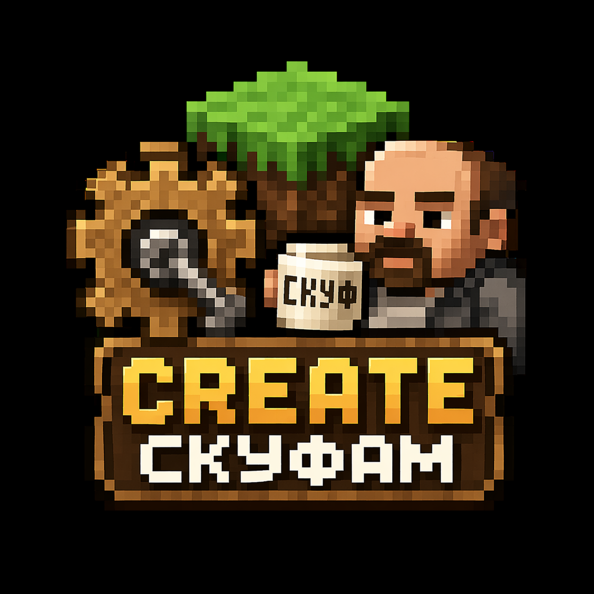

## Руководство по установке

### Шаг 1. Установите NeoForge

1. Скачайте [установщик NeoForge](https://github.com/cobalteek/cobalteeks.skuf.club/blob/master/neoforge-21.1.228-installer.jar).
2. Запустите файл и выберите **Install Client**.
3. Дождитесь завершения установки.

### Шаг 2. Установите сборку

1. Откройте репозиторий сборки: [github.com/cobalteek/cobalteeks.skuf.club](https://github.com/cobalteek/cobalteeks.skuf.club).
2. Найдите последний релиз и скачайте `mods.zip`.
3. Добавьте/Замените папку `mods` в корневую папку игры `.minecraft`
4. По желанию можете установить [ресуспаки](https://github.com/cobalteek/cobalteeks.skuf.club/tree/master/resourcepacks)

> **Важно:** проверьте, чтобы в папке `mods` были моды, а не ещё одна папка `mods`!
> Путь должен выглядеть ../.minecraft/mods/*моды*

### Шаг 3. Запустите игру

1. Откройте лаунчер Minecraft.
2. Выберите профиль **NeoForge 1.21.1**.
3. Нажмите **Play** и дождитесь загрузки.

---

## Устранение неполадок

* **Игра не запускается?** Проверьте, что у вас установлена **Java 21+**.
* **Моды не видны?** Убедитесь, что папка `mods` находится в основной директории Minecraft и в ней есть файлы модов.
* **Ошибки в игре?** Проверьте логи (`logs/latest.log`) на наличие конфликтов модов.

**Вопросы?** Пишите в обсуждениях репозитория или в [Discord cobalteek](https://discord.gg/tQ8crUvAbE).

Приятного геймплея! ✨
